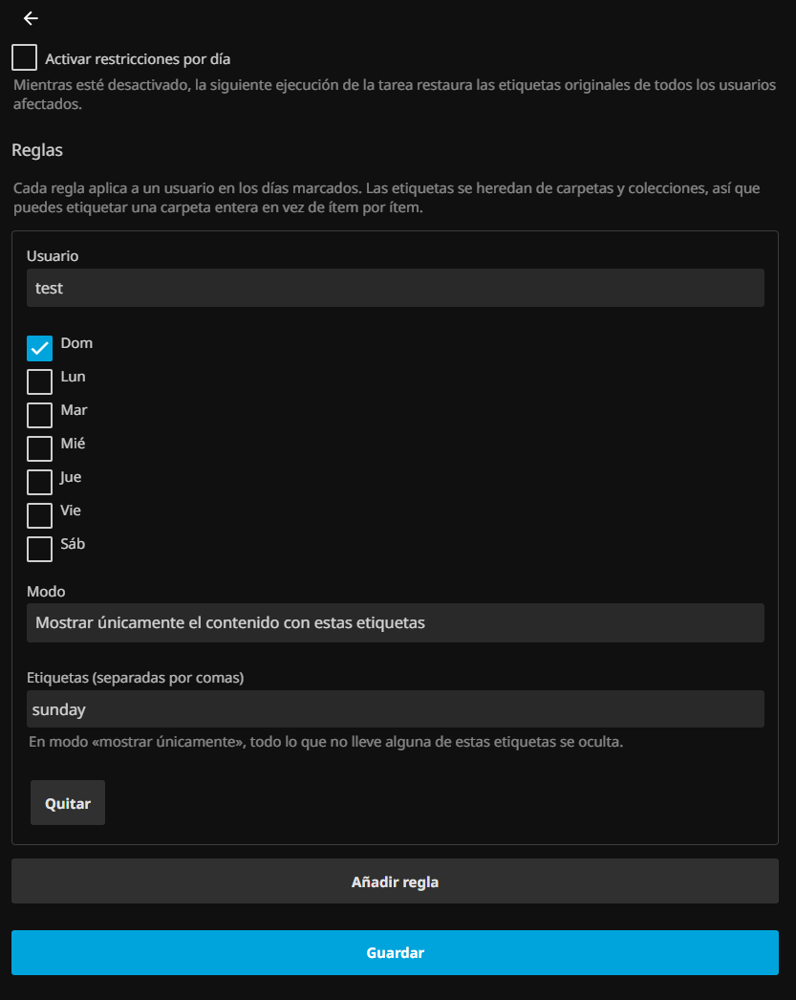

*Read this in [English](README.md).*

# Jellyfin Scheduled Access

Plugin para Jellyfin que restringe qué contenido ve un usuario **según el día de la semana**, usando las etiquetas (tags) de la biblioteca.

Ejemplo: que el usuario `test` solo vea contenido etiquetado como `sunday` los domingos, y su biblioteca completa el resto de la semana.

---

## Requisitos

| | Versión | Nota |
|---|---|---|
| Jellyfin Server | **10.11.x** | El `targetAbi` debe coincidir o el plugin sale como *NotSupported* |
| .NET SDK | **9.0** | Jellyfin 10.11 usa `net9.0`; 10.10 usaba `net8.0` |

Los paquetes `Jellyfin.Controller` / `Jellyfin.Model` del `csproj` deben ir **fijados a la versión exacta del servidor**.

---

## Instalación

### Desde el repositorio (recomendado)

**1. Añade el repositorio.** En *Panel de control → Complementos → **Repositorios*** → **+ Nuevo repositorio**:

| Campo | Valor |
|---|---|
| Nombre | `Scheduled Access` (o el que quieras) |
| URL | `https://raw.githubusercontent.com/bruce-rgb/jellyfin-plugin-scheduled-access/main/manifest.json` |

**2. Instálalo.** Cambia a la pestaña ***Catálogo*** — no a *Repositorios*, que solo lista las fuentes — y busca **Scheduled Access** en la categoría *General*.

**3. Reinicia el servidor.** Jellyfin solo carga plugins nuevos al arrancar.

Esta vía es preferible a copiar archivos a mano: la carpeta la crea el propio servicio, con sus permisos correctos y un `meta.json` coherente, lo que evita los dos problemas descritos en [Depurar](#depurar).

> **Si el plugin no aparece en el catálogo**, comprueba en este orden:
> 1. Que estás mirando *Catálogo* y no *Repositorios*.
> 2. Que la URL responde: ábrela en el navegador, debe devolver el JSON.
> 3. Que el `targetAbi` del manifiesto no sea superior a tu versión de servidor.
> 4. Recarga forzada del navegador (`Ctrl+Shift+R`). La interfaz cachea la lista de paquetes en el cliente, así que una caché vieja oculta un repositorio recién añadido.

### Instalación manual

Descarga el `.zip` de [Releases](https://github.com/bruce-rgb/jellyfin-plugin-scheduled-access/releases), extráelo en una carpeta dentro de `<datadir>/plugins/` y reinicia. Los detalles por sistema están en [Desplegar en un servidor real](#desplegar-en-un-servidor-real-docker).

---

## Cómo funciona

Jellyfin ya evalúa la visibilidad de cada ítem contra dos listas de la política de usuario. Esta es la lógica real del servidor (`BaseItem.IsVisibleViaTags`, v10.11.11):

```csharp
var allTags = GetInheritedTags();
if (user.GetPreference(PreferenceKind.BlockedTags).Any(i => allTags.Contains(i, ...)))
    return false;                                    // BlockedTags gana, se evalúa primero

var parent = GetParents().FirstOrDefault() ?? this;
if (parent is UserRootFolder or AggregateFolder or UserView)
    return true;                                     // el nivel raíz se salta AllowedTags

var allowedTagsPreference = user.GetPreference(PreferenceKind.AllowedTags);
if (!skipAllowedTagsCheck && allowedTagsPreference.Length != 0 &&
    !allowedTagsPreference.Any(i => allTags.Contains(i, ...)))
    return false;                                    // allowlist estricta
```

El plugin **no filtra contenido por su cuenta**: se limita a reescribir `AllowedTags` / `BlockedTags` del usuario según el día, y deja que el servidor haga el resto.

Consecuencias que conviene tener claras:

- **`GetInheritedTags()`**: las etiquetas se heredan de carpetas padre y colecciones. Puedes etiquetar una carpeta entera en vez de ítem por ítem.
- **El nivel raíz se salta el filtro**: las bibliotecas siguen visibles en la pantalla inicial; lo que se filtra es su contenido.

### Los dos modos

| Modo | Campo | Comportamiento | Riesgo |
|---|---|---|---|
| `Block` — *ocultar el contenido con estas etiquetas* | `BlockedTags` | Oculta solo lo etiquetado | **Falla abierto**: contenido nuevo sin etiquetar sigue visible |
| `AllowOnly` — *mostrar únicamente el contenido con estas etiquetas* | `AllowedTags` | Oculta todo lo que **no** lleve la etiqueta | **Falla cerrado**: contenido nuevo sin etiquetar desaparece |

Si el objetivo es restringir de verdad, `AllowOnly` es el modo seguro. Si solo quieres apartar unas pocas cosas concretas, `Block` da menos trabajo de etiquetado.

### Restauración: por qué hay instantáneas

Antes de aplicar la primera restricción a un usuario, el plugin guarda una **instantánea** (`PolicySnapshot`) de sus `AllowedTags` / `BlockedTags` originales, y la persiste en el XML de configuración.

Esto no es incidental, es la pieza crítica de seguridad. Sin ella, si el servidor se apagara un domingo con la restricción puesta, el usuario quedaría restringido **indefinidamente**: no habría forma de saber cuál era su estado original. Con la instantánea en disco, la ejecución del lunes (o del siguiente arranque) la deshace.

El estado deseado se calcula **siempre desde la instantánea**, nunca desde la política actual. Eso hace la tarea idempotente: ejecutarla diez veces no acumula etiquetas.

#### Dos invariantes que hay que respetar

Ambas salieron de bugs reales, y romper cualquiera de las dos deja usuarios restringidos de forma permanente:

**1. La restauración la conducen las instantáneas, no las reglas.**

`ExecuteAsync` trabaja en dos fases: primero aplica las reglas vigentes hoy y anota qué usuarios quedaron restringidos; después recorre **las instantáneas** y deshace toda la que no respalde una restricción vigente.

Lo intuitivo sería recorrer las reglas y restaurar las que hoy no aplican — y está mal. Si borras una regla, ya no hay nada que recorrer: el usuario nunca se visita y su restricción no se deshace jamás. Recorrer instantáneas cubre de una vez regla borrada, día desmarcado, usuario cambiado y plugin desactivado.

Una instantánea solo se descarta si la restauración **se completó**. Si falla, sobrevive y el siguiente disparo lo reintenta.

**2. Las instantáneas nunca se aceptan del cliente.**

Son estado del servidor. `Plugin.UpdateConfiguration` descarta las que lleguen en el `POST` y conserva las suyas:

```csharp
if (configuration is PluginConfiguration incoming)
{
    incoming.Snapshots = Configuration.Snapshots;   // leído ANTES de base.UpdateConfiguration
}
```

Sin esto, la página de configuración las lee al abrirse y las reenvía al guardar. Si la tarea creó una instantánea después de cargar la página, guardar la borra; la siguiente ejecución no encuentra ninguna y toma otra **sobre la política ya restringida**, registrando el estado restringido como si fuera el original.

El síntoma es traicionero: el log dice `Politica restaurada` con toda normalidad, pero restaura al estado corrupto y el usuario sigue restringido. Se detecta en el log por una segunda instantánea del mismo usuario con un conteo distinto de cero:

```
Instantanea de politica guardada para "test" (permitidas=0, ...)   ← original correcto
Instantanea de politica guardada para "test" (permitidas=1, ...)   ← corrupta: capturó lo restringido
```

Si esto ocurre, el dato original se ha perdido y hay que limpiar las etiquetas a mano en **Usuarios → *(usuario)* → Control parental**.

### Disparadores

La tarea `Aplicar restricciones por dia` corre en tres momentos:

| Disparador | Para qué |
|---|---|
| `StartupTrigger` | Corrige el estado si el servidor estuvo apagado al cambiar el día |
| `DailyTrigger` (00:00) | El cambio de día real |
| `IntervalTrigger` (1 h) | Red de seguridad ante suspensiones o cambios de hora |

Desactivar el plugin (`Enabled = false`) **no deja restricciones colgando**: la siguiente ejecución restaura todas las instantáneas pendientes y las descarta.

---

## Configuración

**Panel de control → Complementos → Scheduled Access**



1. Marca *Activar restricciones por día*.
2. **Añadir regla**: elige usuario, marca los días, elige el modo y escribe las etiquetas separadas por comas.
3. Guardar.

Al guardar, el plugin **encola la tarea automáticamente**, así que el cambio surte efecto en segundos sin esperar a medianoche. Esto lo hace `Plugin.UpdateConfiguration`, que es `virtual` en `BasePlugin<T>`:

```csharp
public override void UpdateConfiguration(BasePluginConfiguration configuration)
{
    base.UpdateConfiguration(configuration);
    _taskManager.QueueIfNotRunning<ApplyTagScheduleTask>();
}
```

`ITaskManager` se inyecta por el constructor del plugin: Jellyfin instancia los plugins a través de su contenedor de DI, así que admite servicios además de los dos parámetros obligatorios.

> Tras aplicar, **refresca el cliente o vuelve a iniciar sesión**: la interfaz web cachea las vistas y puede seguir mostrando el contenido anterior aunque la política ya haya cambiado.

También puedes lanzarla a mano desde **Panel de control → Tareas programadas → Aplicar restricciones por dia**.

---

## Localización

La página de configuración viene en **inglés y español**, y elige el idioma automáticamente.

> **Jellyfin no tiene un framework de localización para plugins.** Tampoco expone su módulo `Globalize` a las páginas de plugin: en `window` solo hay `ApiClient`, `Dashboard` y `Emby`. Así que las traducciones las sirve y las aplica el propio plugin, siguiendo el patrón habitual de la comunidad.

Cómo encaja todo:

1. **`Locale/en.json`, `Locale/es.json`** — archivos planos clave/valor, embebidos como recursos.
2. **`Plugin.GetPages()`** registra una entrada por idioma junto a la página de configuración. Es la única forma de exponer archivos propios de un plugin por HTTP sin escribir un controlador de API. Acaban servidos en `web/ConfigurationPage?name=scheduledaccess.<lang>.json`, con `Content-Type: application/json`.
3. **Atributos `data-localize`** en el HTML, cuyo texto es el **respaldo en inglés**. Si la descarga falla, la página se queda en inglés legible en vez de mostrar claves sueltas.
4. **La detección de idioma** replica lo que hace jellyfin-web: leer la elección explícita del usuario en `DisplayPreferences.CustomPrefs.language` y caer a `navigator.language` cuando no está — que es el caso habitual, porque esa preferencia solo se guarda si el usuario elige idioma a mano.

### Añadir un idioma

1. Copia `Locale/en.json` a `Locale/<codigo>.json` y traduce los valores.
2. Añade el código a `Plugin.SupportedLanguages` **y** al array `SUPPORTED` de `configPage.html`. Las dos listas deben coincidir.

El `csproj` incluye `Locale\*.json` por patrón, así que no hay que tocar la compilación.

---

## Desarrollo

### Compilar

```bash
dotnet publish --configuration Debug Jellyfin.Plugin.ScheduledAccess.sln
```

El proyecto compila con `TreatWarningsAsErrors` y todos los analizadores activos (`AnalysisMode=AllEnabledByDefault` + StyleCop + el `jellyfin.ruleset`). Cualquier warning rompe la compilación; es intencional.

Dos reglas que muerden al escribir configuración:

- **SA1402 / SA1649**: una clase por archivo, y el nombre del archivo debe coincidir. Un `enum` sí puede acompañar a una clase.
- **CA1819** (no exponer arrays en propiedades) **no está desactivada** en el ruleset. Aun así los tipos de configuración **usan arrays**, con supresión puntual y documentada: deben viajar por `XmlSerializer` (config en disco) y por `System.Text.Json` (página web), y las colecciones de solo lectura no son fiables con el segundo. Perder reglas en silencio al guardar sería peor que el olor de diseño.

### Desplegar en local

Tareas de VS Code (`Ctrl+Shift+P → Tasks: Run Task`):

| Tarea | Qué hace |
|---|---|
| **`deploy`** | Compila y despliega. Es la que usarás normalmente (también con `Ctrl+Shift+B`) |
| **`build`** | Solo compila, sin desplegar ni pasar por el UAC |
| **`tail-log`** | Sigue el log del servidor en vivo |
| **`tail-log-plugin`** | Igual, pero filtrado a las líneas del plugin |

`Ctrl+Shift+B` es un atajo directo a `deploy`, por ser la tarea de build por defecto. Las dos de log quedan corriendo hasta que las pares desde el panel de terminal.

La lógica vive en [scripts/deploy-local.ps1](scripts/deploy-local.ps1), que también puedes ejecutar a mano. Agrupa **parar → copiar → permisos → arrancar en una sola elevación**, por dos motivos:

1. Jellyfin mantiene la DLL bloqueada mientras corre; copiar con el servicio arriba falla con `IOException`.
2. Parar y arrancar un servicio exige privilegios de administrador. Agruparlo evita encadenar varios avisos de UAC.

**Aceptar el UAC es manual.** No hay forma de evitarlo con Jellyfin instalado como servicio.

> **El `meta.json` debe llevar la versión real del ensamblado.** El script la lee del binario recién compilado en vez de escribirla a mano, y no es un detalle cosmético.
>
> Jellyfin **registra** el plugin por la versión del manifiesto, pero el panel **muestra y envía** la del ensamblado. Si divergen, `DELETE /Plugins/{guid}/{version}` responde **404**: busca una versión que no tiene registrada. El síntoma engaña, porque el plugin carga y funciona con normalidad; lo que falla es desinstalarlo o actualizarlo desde el panel.
>
> Ocurría al copiar solo la salida de compilación: la DLL se actualizaba y el `meta.json` se quedaba con la versión del primer despliegue. Se detecta comparando lo que dice el log al arrancar con lo que muestra el panel:
>
> ```
> Loaded assembly "...Version=1.0.0.0..."      ← el ensamblado
> Loaded plugin: "Scheduled Access" "0.0.0.0"  ← el manifiesto: no coinciden
> ```

Se copia también el `.pdb`: es lo que permite poner breakpoints.

> **Por qué la tarea ejecuta `icacls` al final.** Por la regla `CREATOR OWNER` de Windows, la carpeta del plugin queda en poder del usuario que la crea — tú, al desplegar. El servicio corre como `NT AUTHORITY\NETWORK SERVICE` y solo hereda `BUILTIN\Usuarios:(RX)`: lectura y ejecución, **sin permiso de borrado**.
>
> El síntoma es engañoso, porque el plugin **carga sin problemas**. Lo que falla es **desinstalarlo o actualizarlo desde el panel**: el servicio no puede borrar unos archivos que no le pertenecen. Se diagnostica comparando las ACL:
>
> ```powershell
> icacls "$env:ProgramData\Jellyfin\Server\plugins"
> icacls "$env:ProgramData\Jellyfin\Server\plugins\Jellyfin.Plugin.ScheduledAccess"
> ```
>
> Si en la segunda no aparece `NETWORK SERVICE`, es esto. Se arregla con:
>
> ```powershell
> icacls "<carpeta del plugin>" /grant "NT AUTHORITY\NETWORK SERVICE:(OI)(CI)F" /T
> ```
>
> Los plugins instalados desde un repositorio no sufren esto: los crea el propio servicio, así que ya los posee.

Las rutas se configuran en [.vscode/settings.json](.vscode/settings.json). `jellyfinDataDir` debe apuntar al data dir **real** del servidor, que depende del modo de instalación:

| Instalación | Data dir |
|---|---|
| Servicio de Windows | `C:\ProgramData\Jellyfin\Server` |
| App de bandeja / usuario | `%LOCALAPPDATA%\jellyfin` |

Para confirmarlo sin adivinar, consulta los parámetros reales del servicio:

```powershell
Get-ItemProperty "HKLM:\SYSTEM\CurrentControlSet\Services\JellyfinServer\Parameters" |
    Select-Object Application, AppParameters
```

### Depurar

**Lo primero que hay que descartar: ¿ha corrido la tarea desde que guardaste?** Guardar la encola automáticamente, pero si has editado el XML a mano, o el encolado falló, no se habrá aplicado nada. Es la causa más común de "no funciona".

Tres sitios donde mirar, en orden:

**1. El XML de configuración** — dice qué se guardó y qué se aplicó:

```powershell
Get-Content "C:\ProgramData\Jellyfin\Server\plugins\configurations\Jellyfin.Plugin.ScheduledAccess.xml" -Raw
```

`<Snapshots />` vacío significa que **nunca se aplicó ninguna restricción**. Si hay un `<PolicySnapshot>`, el plugin ya tocó la política de ese usuario.

**2. El log del servidor** — la tarea registra cada acción:

```powershell
$log = Get-ChildItem "C:\ProgramData\Jellyfin\Server\log" -Filter "log_*.log" |
    Sort-Object LastWriteTime -Descending | Select-Object -First 1
Select-String -Path $log.FullName -Pattern "Restriccion aplicada|Instantanea|Politica restaurada"
```

Salida esperada:

```
ApplyTagScheduleTask: Instantanea de politica guardada para "test" (permitidas=0, bloqueadas=0)
ApplyTagScheduleTask: Restriccion aplicada a "test" para Sunday en modo AllowOnly con 1 etiquetas
```

**3. La política del usuario** en Panel de control → Usuarios → *(usuario)* → Control parental, para ver las etiquetas que el plugin escribió.

Tras aplicar, **refresca el cliente o vuelve a iniciar sesión**: la interfaz web cachea las vistas y puede seguir mostrando el contenido anterior.

#### Breakpoints

El servidor es un binario oficial, no compilado desde fuente, así que la depuración es por **attach**, no launch: ejecuta `deploy`, espera a que arranque y lanza *Adjuntar a Jellyfin* ([.vscode/launch.json](.vscode/launch.json)).

Como el servicio corre bajo `NT Authority\NetworkService`, **VS Code debe abrirse como administrador** para poder adjuntarse.

---

## Desplegar en un servidor real (Docker)

### 1. Empaquetar

```powershell
.\scripts\package.ps1
```

Compila en **Release** y deja `dist/Jellyfin.Plugin.ScheduledAccess/` con solo la DLL y un `meta.json` completo. Excluye a propósito el `.pdb` (símbolos de depuración), el `.xml` (documentación) y el `.deps.json`: el servidor no los necesita para cargar el plugin.

El `meta.json` se escribe a mano porque el que genera Jellyfin al instalar en caliente deja `version: 0.0.0.0` y los campos descriptivos vacíos. Su `targetAbi` es `10.11.0.0`, no `10.11.11.0`, para que valga en toda la serie 10.11.x en lugar de un único parche.

> **La ABI tiene que coincidir con el servidor de destino.** Un plugin compilado contra 10.11 no carga en 10.10: aparecerá como *NotSupported*. La DLL es IL puro, así que la arquitectura (x86_64, ARM) es indiferente — solo importa la versión.

### 2. Localizar el volumen de configuración

El plugin va en `<config>/plugins/`, donde `<config>` es la ruta del host mapeada a `/config` en el contenedor:

```bash
docker inspect -f '{{range .Mounts}}{{.Source}} -> {{.Destination}}{{"\n"}}{{end}}' jellyfin
```

### 3. Copiar y ajustar permisos

```bash
scp -r dist/Jellyfin.Plugin.ScheduledAccess usuario@servidor:/tmp/

# ya en el servidor, con <config> sustituido por la ruta real
sudo mv /tmp/Jellyfin.Plugin.ScheduledAccess <config>/plugins/
```

**El propietario debe coincidir con el usuario que corre dentro del contenedor**, o el plugin no se leerá. En vez de adivinar el UID, copia el de una carpeta que Jellyfin ya use:

```bash
sudo chown -R --reference=<config>/config <config>/plugins/Jellyfin.Plugin.ScheduledAccess
sudo chmod -R u+rwX,go+rX <config>/plugins/Jellyfin.Plugin.ScheduledAccess
```

> **Cuidado con `PUID`/`PGID`.** Son una convención de las imágenes de **linuxserver.io**. La imagen **oficial** `jellyfin/jellyfin` las ignora por completo: el usuario se controla con la clave `user:` del compose, y sin ella el contenedor corre como **root**. Un `docker-compose.yml` con la imagen oficial y `PUID=1000` es engañoso — esas variables no hacen nada, y hacer `chown 1000` sería justo el error.

### Zona horaria

El plugin decide el día con `DateTime.Now.DayOfWeek`, que es la hora **local del contenedor**. Define `TZ` en el compose:

```yaml
environment:
  - TZ=America/Mexico_City
```

Sin `TZ` el contenedor corre en UTC y el cambio de día ocurrirá desfasado respecto a tu horario real — el "domingo" empezaría y terminaría a la hora equivocada.

### 4. Reiniciar y verificar

```bash
docker restart jellyfin
docker logs jellyfin 2>&1 | grep -i scheduledaccess
```

Salida esperada:

```
Loaded assembly "Jellyfin.Plugin.ScheduledAccess, Version=1.0.0.0, ..."
Loaded plugin: "Scheduled Access" "1.0.0.0"
```

Si no aparece nada, el orden de sospechas es: permisos del archivo → `targetAbi` incompatible → ruta equivocada (que el volumen mapeado no sea el que creías).

---

## Publicar una versión

En Jellyfin no hay tienda ni proceso de aprobación: **un repositorio de plugins es solo una URL a un JSON**. El usuario la añade en *Panel de control → Complementos → Repositorios* y ya ve tus plugins.

Los usuarios instalan añadiendo esta URL:

```
https://raw.githubusercontent.com/<owner>/<repo>/main/manifest.json
```

### Publicar automáticamente

```bash
git tag v1.0.0.0
git push origin v1.0.0.0
```

El workflow [.github/workflows/release.yml](.github/workflows/release.yml) compila, publica el zip en Releases, calcula el checksum y confirma el `manifest.json` actualizado en `main`. La versión sale **del tag**, y de ahí se propaga al ensamblado, al `meta.json`, al nombre del zip y al manifiesto, de modo que no puedan desincronizarse.

El orden importa: el zip se sube **antes** de confirmar el manifiesto, porque la `sourceUrl` que este contiene debe existir ya cuando alguien lo lea.

### Publicar a mano

```powershell
.\scripts\package.ps1 -Version 1.2.0.0 -Changelog "Que cambio"
```

Genera el zip en `dist/`, actualiza `manifest.json`, y tú subes el zip al release correspondiente.

> **El zip no es reproducible**: lleva marcas de tiempo, así que cada compilación produce un MD5 distinto. Si reejecutas el script después de haber subido el zip, el checksum del manifiesto dejará de coincidir con el binario publicado y el servidor rechazará la descarga. Sube **exactamente** el zip de la ejecución que generó el manifiesto. En CI esto no pasa porque ambos salen de la misma ejecución.

### Detalles del formato que cuestan un rato descubrir

- El **checksum es MD5** del zip, en minúsculas. Es lo que valida el servidor al descargar; si no cuadra, el error que ve el usuario no explica la causa.
- El zip lleva los archivos **en la raíz**, no dentro de una subcarpeta: Jellyfin lo extrae directamente sobre el directorio del plugin.
- Los JSON se escriben **sin BOM**. `Out-File -Encoding utf8` en Windows PowerShell 5.1 lo añade, y rompe tanto a `ConvertFrom-Json` al releer como a quien consuma el manifiesto.
- El manifiesto debe ser **siempre un array**, aunque publiques un solo plugin.
- El `guid` tiene que ser único en todo el ecosistema, y **debe coincidir** con el `Plugin.Id` del código.

### Obligación de licencia

El binario enlaza contra paquetes GPLv3, así que **es GPLv3**. Distribuirlo obliga a publicar el código: el repositorio tiene que ser **público**.

---

## Alternativa nativa: no siempre hace falta este plugin

Jellyfin ya trae restricción por día de la semana, sin plugins: `UserPolicy.AccessSchedules`, en **Usuarios → *(usuario)* → Horario de acceso**.

```
AccessSchedule:   DayOfWeek (DynamicDayOfWeek), StartHour, EndHour
DynamicDayOfWeek: Sunday=0 … Saturday=6, Everyday=7, Weekday=8, Weekend=9
```

**Si lo que quieres es que alguien no pueda entrar los domingos, o solo en ciertas horas, usa esto y olvídate del plugin.** Es todo-o-nada: bloquea la sesión completa y no distingue entre bibliotecas ni etiquetas.

Este plugin solo aporta valor cuando el usuario **sí debe poder entrar** ese día, pero viendo un subconjunto del contenido.

---

## Estado y limitaciones conocidas

- **El nombre de la tarea programada solo existe en inglés.** Jellyfin expone el nombre de una tarea como una única cadena para todo el servidor, no por usuario, así que no admite localización. La página de configuración **sí** está localizada — ver más abajo.
- **Las reglas también aplican a cuentas de administrador** (verificado en 10.11.11). A diferencia de otros controles parentales de Jellyfin, el filtrado por etiquetas no exime a los admin: si te aplicas una regla a ti mismo, verás la biblioteca recortada igual que cualquier otro usuario. Ten cuidado de no dejarte fuera del contenido que necesitas.
- La versión que muestra el gestor de complementos sale como `0.0.0.0` en instalaciones manuales, porque se lee del manifiesto y no del ensamblado. Es cosmético en desarrollo.
- Las reglas no validan solapamientos: si dos reglas apuntan al mismo usuario y día, gana la última en aplicarse.

## Licencia

GPLv3 — ver [LICENSE](LICENSE). Los plugins de Jellyfin enlazan contra paquetes GPLv3, así que el binario resultante es GPLv3 aunque el código fuente lleve otra licencia permisiva.
