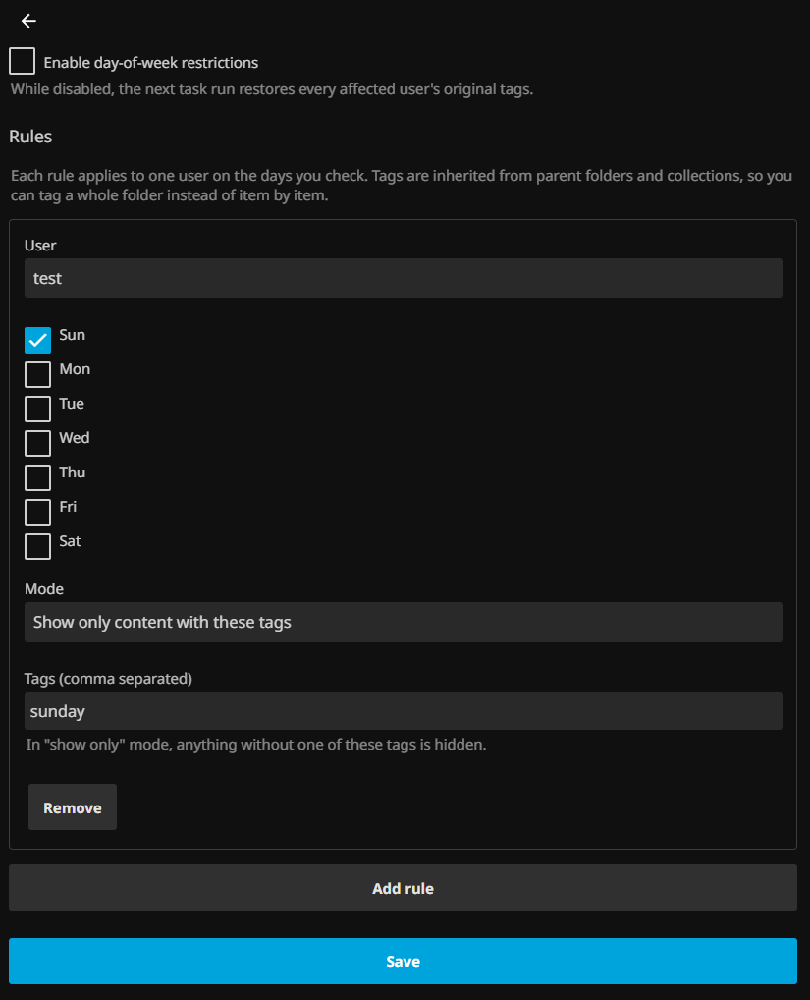

# Scheduled Access — Restrict Jellyfin media by day and time

**Jellyfin plugin to restrict media access by day of the week and time.**

Restrict movies, TV shows and other media based on the day and time, using Jellyfin tags and libraries. A user signs in normally, but only sees the content you allow for that moment.

---

## Use cases

- Allow educational content Monday–Friday.
- Allow cartoons only on weekends.
- Restrict children's content during school hours.
- Give a Jellyfin user different media access depending on the day.
- Create weekday/weekend content schedules.
- Show only a specific library during certain hours of the day.
- Swap what a kids account can watch between morning and evening.

---

## How is this different from Jellyfin's Access Schedule?

Jellyfin already ships **Access Schedule** (*Users → (user) → Access Schedule*), and it is easy to assume it already does this. It doesn't.

> Jellyfin's built-in **Access Schedule** controls **when a user can access Jellyfin**.
>
> This plugin controls **what content the user can access** depending on the current day and time.

Access Schedule is all-or-nothing: outside the allowed window the user simply can't get in. It doesn't distinguish between libraries or between kinds of content.

**If all you want is to stop someone signing in on Sundays, or outside certain hours, use Access Schedule and skip this plugin.** This plugin earns its place when the user **should** be able to sign in, but should see a different subset of the library depending on the day and time.

---

## Requirements

| | Version | Note |
|---|---|---|
| Jellyfin Server | **10.11.x** | The `targetAbi` must match, or the plugin shows up as *NotSupported* |

The DLL is pure IL, so the architecture (x86_64, ARM) is irrelevant — only the server version matters. The same build works on a Raspberry Pi and on an x86 server.

---

## Installation

### From the repository (recommended)

**1. Add the repository.** Under *Dashboard → Plugins → **Repositories*** → **+ New repository**:

| Field | Value |
|---|---|
| Name | `Scheduled Access` (or whatever you like) |
| URL | `https://raw.githubusercontent.com/bruce-rgb/jellyfin-plugin-scheduled-access/main/manifest.json` |

**2. Install it.** Switch to the ***Catalog*** tab — not *Repositories*, which only lists sources — and look for **Scheduled Access** under the *General* category.

**3. Restart the server.** Jellyfin only loads new plugins at startup.

Prefer this over copying files by hand: the folder is created by the service itself, with correct ownership and a consistent `meta.json`.

> **If the plugin doesn't show up in the catalog**, check in this order:
> 1. That you're looking at *Catalog*, not *Repositories*.
> 2. That the URL responds — open it in a browser, it should return JSON.
> 3. That the manifest's `targetAbi` isn't higher than your server version.
> 4. Hard-refresh the browser (`Ctrl+Shift+R`). The web UI caches the package list client-side, so a stale cache hides a repository you just added.

### Manual installation

Download the `.zip` from [Releases](https://github.com/bruce-rgb/jellyfin-plugin-scheduled-access/releases), extract it into a folder under `<datadir>/plugins/` and restart. Per-platform details, including Docker, are in [docs/DEVELOPMENT.md](docs/DEVELOPMENT.md).

---

## Configuration

**Dashboard → Plugins → Scheduled Access**

1. Tick *Enable day-of-week restrictions*.
2. **Add rule**: pick a user, check the days, set the time slot, optionally check libraries, choose the tag mode and enter comma-separated tags.
3. Save.

Changes apply within seconds — saving wakes the plugin immediately, so there's no need to wait for midnight or restart anything.

A worked example — educational content on weekday mornings, cartoons before dinner:

| Rule | Days | Slot | Mode | Tags |
|---|---|---|---|---|
| Learning time | Mon–Fri | 07:00–12:00 | Show only | `educational` |
| Wind-down | Mon–Fri | 16:00–19:00 | Show only | `cartoons` |

Outside both slots no rule applies, so the child sees their normal library.

> After a rule applies, **refresh the client or sign out and back in**: the web UI caches views and may keep showing the previous content even though the policy already changed.

### The two tag modes

This is the setting most worth understanding before you save, because the two modes fail in opposite directions:

| Mode | Behaviour | Risk |
|---|---|---|
| **Hide content with these tags** | Hides only what is tagged | **Fails open**: new untagged content stays visible |
| **Show only content with these tags** | Hides everything **without** the tag | **Fails closed**: new untagged content disappears |

If the goal is to genuinely restrict what a child can reach, *show only* is the safe mode — anything you forget to tag stays hidden rather than slipping through. If you only want to set aside a few specific things, *hide* requires far less tagging work.

Tags are **inherited from parent folders and collections**, so you can tag a whole folder instead of item by item.

### Time slots

- **Both times at 00:00** covers the whole day.
- **The end is exclusive**: at 11:00 sharp, an 08:00–11:00 slot no longer applies.
- **End earlier than start** runs past midnight, and **the checked day is the one the slot starts on** — a Sunday 22:00–06:00 rule is still active on Monday at 02:00.
- **When slots overlap, the shortest wins**, so a specific slot can override a general one without having to carve up the general rule.

### Libraries

A rule can also limit which libraries are visible while it's active. The two filters combine: you can restrict to one library **and** filter by tags inside it. Leaving every library unchecked means library access isn't touched at all.

---

## Known limitations

- **Rules apply to administrator accounts too** (verified on 10.11.11). Unlike other Jellyfin parental controls, tag filtering doesn't exempt admins: if you apply a rule to yourself, you'll see the same trimmed library as anyone else. Be careful not to lock yourself out of content you need.
- Overlapping slots resolve by "shortest wins", but the configuration page doesn't warn you when they overlap. You have to reason about it yourself.
- The plugin does **not** hide content the user has already watched. It schedules by day, time, tag and library only.
- The scheduled task name appears in English regardless of your language. Jellyfin exposes a task's name as a single server-wide string, not per user, so it can't be localised. The configuration page itself is localised (English and Spanish).

---

## Documentation

Architecture, local development, debugging, Docker deployment and the release process are in **[docs/DEVELOPMENT.md](docs/DEVELOPMENT.md)**.

## Licence

GPLv3 — see [LICENSE](LICENSE). Jellyfin plugins link against GPLv3 packages, so the resulting binary is GPLv3 even if the source carries a more permissive licence.
