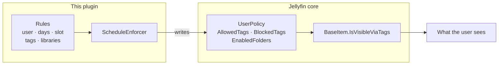
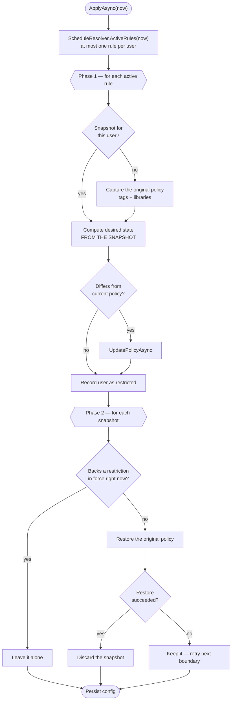
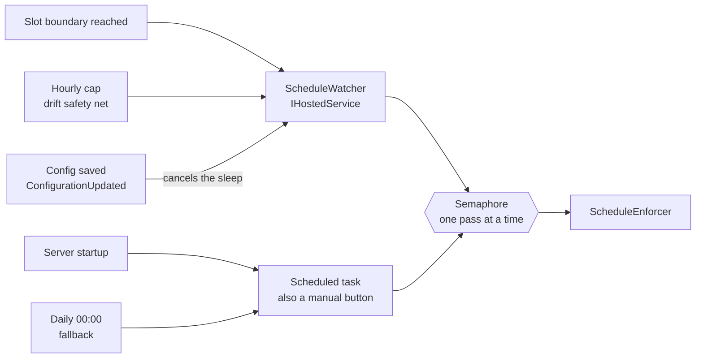

# Development

Architecture, local setup, debugging, deployment and the release process.
For what the plugin does and how to configure it, see the [README](../README.md).

---

## How it works

Jellyfin already evaluates each item's visibility against two lists in the user policy. This is the server's actual logic (`BaseItem.IsVisibleViaTags`, v10.11.11):

```csharp
var allTags = GetInheritedTags();
if (user.GetPreference(PreferenceKind.BlockedTags).Any(i => allTags.Contains(i, ...)))
    return false;                                    // BlockedTags wins, evaluated first

var parent = GetParents().FirstOrDefault() ?? this;
if (parent is UserRootFolder or AggregateFolder or UserView)
    return true;                                     // root level skips the AllowedTags check

var allowedTagsPreference = user.GetPreference(PreferenceKind.AllowedTags);
if (!skipAllowedTagsCheck && allowedTagsPreference.Length != 0 &&
    !allowedTagsPreference.Any(i => allTags.Contains(i, ...)))
    return false;                                    // strict allowlist
```

The plugin **does not filter content itself**: it rewrites the user's `AllowedTags` / `BlockedTags` / `EnabledFolders` according to the current day and time, and lets the server do the rest.



The arrow marked *writes* is the whole integration surface. Nothing is intercepted, patched or proxied, which is why the plugin survives server upgrades that don't change `UserPolicy`.

Two consequences worth knowing:

- **`GetInheritedTags()`**: tags are inherited from parent folders and collections.
- **Root level skips the filter**: libraries stay visible on the home screen; what gets filtered is their contents.

### Restoration: why snapshots exist

Before applying the first restriction to a user, the plugin saves a **snapshot** (`PolicySnapshot`) of their original tags and library access, and persists it in the configuration XML.

This isn't incidental — it's the critical safety mechanism. Without it, if the server were shut down mid-slot with a restriction in place, the user would stay restricted **indefinitely**: there would be no way to know their original state. With the snapshot on disk, the next run undoes it.

The desired state is **always computed from the snapshot**, never from the current policy. That makes the pass idempotent: running it a hundred times doesn't accumulate tags, which matters because with time slots it runs far more often than it used to.



Two things in that diagram are the invariants below, drawn:

- **Phase 2 iterates snapshots, not rules.** A deleted rule disappears from phase 1 but its snapshot still gets walked, so the restriction is undone.
- **The snapshot is only taken when there isn't one.** Chaining two slots back to back never re-captures, so an already-restricted policy can't be recorded as the original.

#### Three invariants that must hold

All three came out of real bugs, and breaking any of them leaves users restricted with no way back:

**1. Restoration is driven by snapshots, not by rules.**

`ScheduleEnforcer` works in two phases: first it applies the rules in effect *right now* and records which users ended up restricted; then it walks **the snapshots** and undoes every one that doesn't back a current restriction.

The intuitive approach would be to walk the rules and restore the ones that don't apply — and it's wrong. If you delete a rule, there's nothing left to walk: the user is never visited and their restriction is never undone. Walking snapshots covers deleted rules, expired slots, unchecked days, changed users and a disabled plugin all at once.

A snapshot is only discarded if restoration **succeeded**. If it fails, the snapshot survives and the next boundary retries.

**2. Snapshots are never accepted from the client.**

They are server state. `Plugin.UpdateConfiguration` discards any that arrive in the `POST` and keeps its own:

```csharp
if (configuration is PluginConfiguration incoming)
{
    incoming.Snapshots = Configuration.Snapshots;   // read BEFORE base.UpdateConfiguration
}
```

Without this, the config page reads them when it opens and sends them back on save. If a snapshot was created after the page loaded, saving deletes it; the next run finds none and takes a fresh one **against the already-restricted policy**, recording the restricted state as if it were the original.

The symptom is treacherous: the log reports `Policy restored` perfectly normally, but restores to the corrupted state and the user stays restricted. You spot it in the log as a second snapshot for the same user with a non-zero count:

```
Policy snapshot saved for "test" (allowed=0, ...)   ← correct original
Policy snapshot saved for "test" (allowed=1, ...)   ← corrupt: captured the restricted state
```

If this happens the original data is lost, and the tags must be cleared by hand under **Users → *(user)* → Parental Control**.

**3. A snapshot without library state must not restore libraries.**

`PolicySnapshot.HasFolderState` looks redundant and isn't. Snapshots written before library support carry no folder fields, so re-reading them yields the defaults: no folders and `EnableAllFolders` false. Restoring that literally would strip the user's access to **everything**.

With the flag, an old snapshot restores tags only, leaves libraries untouched and logs a warning.

### Time slots

`ScheduleRule` carries `StartMinutes` and `EndMinutes`, minutes from midnight. Minutes rather than decimal hours so boundaries are exact and map directly onto an `<input type="time">`.

`ScheduleResolver` holds the whole decision, deliberately as pure logic with no server dependencies, because that's where the awkward cases live:

- **Full day** is `start == end`, or a span covering 1440 minutes.
- **The end is exclusive.**
- **Wrapping past midnight** is `start > end`. The checked day is the **start** day: a Sunday 22:00–06:00 rule is still active on Monday at 02:00, which is implemented by also testing yesterday's day-of-week for the tail.
- **Overlaps**: shortest duration wins, ties broken by declaration order so the outcome is deterministic.

Rules saved by earlier versions have no slot in the XML. `EndMinutes` is initialised to a full day so `XmlSerializer` — which leaves absent elements at their initialised value — migrates them to "applies all day" instead of "never applies".

### What drives it: a watcher, not a polling task

Time slots need precision a scheduled task can't give. An interval trigger would fire up to an hour late, and dropping it to minutes would flood the dashboard's task history with hundreds of daily entries.

Instead, `ScheduleWatcher` — an `IHostedService` registered through `IPluginServiceRegistrator` — computes the next slot boundary and sleeps exactly until it, leaving no trace in that history. Measured in practice, it restores within milliseconds of the boundary.

Saving the configuration raises `Plugin.ConfigurationUpdated`, which cancels the watcher's sleep so a new rule takes effect immediately instead of waiting for a wake-up that might be hours away:

```csharp
public override void UpdateConfiguration(BasePluginConfiguration configuration)
{
    // ... snapshots preserved here ...
    base.UpdateConfiguration(configuration);
    ConfigurationUpdated?.Invoke(this, EventArgs.Empty);
}
```

Each sleep is capped at one hour as a safety net: if the machine suspends, the clock changes, or DST shifts, recomputing hourly corrects the drift at no real cost, because a pass with nothing to change writes nothing.

The `Apply day-of-week restrictions` scheduled task remains, with only a startup and a daily trigger. It's a manual button for diagnosis and a daily fallback in case the watcher fails to start — not the thing that switches slots.

Both call the same `ScheduleEnforcer`, the only code that writes policies, and it serialises its runs behind a semaphore. Two concurrent passes could interleave reading and writing snapshots and record an already-restricted state as the original — invariant 2, from the other direction.



The watcher is what actually switches slots; the scheduled task is a manual button and a fallback for the case where the hosted service never starts. They can fire at the same moment — a server restart triggers both — which is why the semaphore isn't optional.

The watcher's loop is: apply for *now*, ask the resolver when the next boundary falls, sleep until then (capped at an hour), repeat. A pass with nothing to change writes nothing, so the extra wake-ups from that cap cost nothing.

Disabling the plugin (`Enabled = false`) **leaves no restrictions dangling**: the next run restores every pending snapshot and discards them.

---

## Localisation

The configuration page ships in **English and Spanish**, picking the language automatically.

> **Jellyfin has no localisation framework for plugins.** It doesn't expose its `Globalize` module to plugin pages either — only `ApiClient`, `Dashboard` and `Emby` are on `window`. So the translations are served and applied by the plugin itself, following the pattern used across the community.

How it fits together:

1. **`Locale/en.json`, `Locale/es.json`** — flat key/value files, embedded as resources.
2. **`Plugin.GetPages()`** registers one entry per language alongside the config page. That's the only way to expose a plugin's own files over HTTP without writing an API controller. They end up served at `web/ConfigurationPage?name=scheduledaccess.<lang>.json`, with `Content-Type: application/json`.
3. **`data-localize` attributes** in the HTML, whose text is the **English fallback**. If the fetch fails, the page stays in readable English instead of showing raw keys.
4. **Language detection** mirrors what jellyfin-web does: read the user's explicit choice from `DisplayPreferences.CustomPrefs.language`, and fall back to `navigator.language` when it isn't set — which is the common case, since the setting is only stored once the user picks a language by hand.

### Adding a language

1. Copy `Locale/en.json` to `Locale/<code>.json` and translate the values.
2. Add the code to `Plugin.SupportedLanguages` **and** to the `SUPPORTED` array in `configPage.html`. Both lists must agree.

The `csproj` globs `Locale\*.json`, so no build change is needed.

---

## Building

Requires the **.NET SDK 9.0** — Jellyfin 10.11 targets `net9.0`; 10.10 targeted `net8.0`. The `Jellyfin.Controller` / `Jellyfin.Model` packages must be **pinned to the server's exact version**.

```bash
dotnet publish --configuration Debug Jellyfin.Plugin.ScheduledAccess.sln
```

The project builds with `TreatWarningsAsErrors` and every analyzer enabled (`AnalysisMode=AllEnabledByDefault` + StyleCop + `jellyfin.ruleset`). Any warning breaks the build; that's intentional.

Rules that bite in practice:

- **SA1402 / SA1649**: one class per file, and the file name must match. An `enum` may accompany a class.
- **SA1201**: members must appear in a fixed order — fields, constructors, events, properties, methods.
- **CA1819** (don't expose arrays in properties) is **not disabled** in the ruleset. The configuration types **use arrays anyway**, with a narrow documented suppression: they must round-trip through `XmlSerializer` (config on disk) and `System.Text.Json` (the web page), and read-only collections aren't reliable with the latter. Silently losing rules on save would be worse than the design smell.

---

## Tests

```bash
dotnet test
```

The suite covers `ScheduleResolver` — when a rule is in force and when the next boundary falls. That's deliberately the only thing tested: it's pure logic with no server dependencies, and it's where every awkward case lives. The rest of the plugin is mostly orchestration over Jellyfin's own APIs, which is better verified by running it than by mocking it.

Cases worth keeping green:

- Slot start inclusive, **end exclusive**
- Whole day expressed both as `0–0` (what the UI sends) and `0–1440` (what migrated rules look like)
- **Wrapping past midnight**, including that the tail belongs to the start day and doesn't leak into the previous one
- Overlaps resolving shortest-first, one rule per user, ties broken deterministically
- Next boundary always strictly in the future — returning "now" would spin the watcher in a tight loop

Dates in the tests are fixed rather than `DateTime.Now`, so the suite doesn't pass or fail depending on the day it runs.

The release workflow runs `dotnet test` before packaging: a broken release is far more expensive to undo than one that never ships.

> Note that `dotnet publish` targets the plugin `.csproj`, not the `.sln`. Publishing the solution would drag the test assembly into the output.

---

## Deploying locally

VS Code tasks (`Ctrl+Shift+P → Tasks: Run Task`):

| Task | What it does |
|---|---|
| **`deploy`** | Builds and deploys. The one you'll normally use (also `Ctrl+Shift+B`) |
| **`build`** | Builds only — no deploy, no UAC prompt |
| **`tail-log`** | Follows the server log live |
| **`tail-log-plugin`** | Same, filtered to the plugin's lines |

Both log tasks keep running until you stop them from the terminal panel.

The logic lives in [scripts/deploy-local.ps1](../scripts/deploy-local.ps1), which you can also run by hand. It groups **stop → copy → permissions → start into a single elevation**, for two reasons:

1. Jellyfin keeps the DLL locked while running; copying with the service up fails with `IOException`.
2. Stopping and starting a service requires administrator rights. Grouping avoids chaining several UAC prompts.

**Accepting the UAC prompt is manual.** There's no way around it with Jellyfin installed as a service.

The `.pdb` is copied too: that's what enables breakpoints.

> **`meta.json` must carry the assembly's real version.** The script reads it from the freshly built binary instead of hardcoding it, and that's not cosmetic.
>
> Jellyfin **registers** the plugin by the manifest version, but the dashboard **displays and sends** the assembly version. If they diverge, `DELETE /Plugins/{guid}/{version}` returns **404**: it's looking for a version it has no record of. The symptom misleads, because the plugin loads and works fine; what breaks is uninstalling or updating from the dashboard.
>
> This happened when only the build output was copied: the DLL got updated while `meta.json` kept the version from the first deploy. You spot it by comparing the startup log against the dashboard:
>
> ```
> Loaded assembly "...Version=1.0.0.0..."      ← the assembly
> Loaded plugin: "Scheduled Access" "0.0.0.0"  ← the manifest: they don't match
> ```

> **Why the script runs `icacls` at the end.** Because of Windows' `CREATOR OWNER` rule, the plugin folder ends up owned by whoever creates it — you, when deploying. The service runs as `NT AUTHORITY\NETWORK SERVICE` and only inherits `BUILTIN\Users:(RX)`: read and execute, **no delete permission**.
>
> The symptom is deceptive, because the plugin **loads without trouble**. What fails is **uninstalling or updating from the dashboard**: the service can't delete files it doesn't own. Diagnose by comparing the ACLs:
>
> ```powershell
> icacls "$env:ProgramData\Jellyfin\Server\plugins"
> icacls "$env:ProgramData\Jellyfin\Server\plugins\Jellyfin.Plugin.ScheduledAccess"
> ```
>
> If `NETWORK SERVICE` is missing from the second one, this is it. Fix with:
>
> ```powershell
> icacls "<plugin folder>" /grant "NT AUTHORITY\NETWORK SERVICE:(OI)(CI)F" /T
> ```
>
> Plugins installed from a repository don't suffer from this: the service creates them, so it already owns them.

Paths are configured in [.vscode/settings.json](../.vscode/settings.json). `jellyfinDataDir` must point at the server's **actual** data dir, which depends on the install mode:

| Installation | Data dir |
|---|---|
| Windows service | `C:\ProgramData\Jellyfin\Server` |
| Tray / user app | `%LOCALAPPDATA%\jellyfin` |

To confirm it without guessing, read the service's actual parameters:

```powershell
Get-ItemProperty "HKLM:\SYSTEM\CurrentControlSet\Services\JellyfinServer\Parameters" |
    Select-Object Application, AppParameters
```

---

## Debugging

**Rule out first: has anything run since you saved?** Saving wakes the watcher automatically, but if you edited the XML by hand, or the watcher never started, nothing has been applied.

Three places to look, in order:

**1. The configuration XML** — tells you what was saved and what was applied:

```powershell
Get-Content "C:\ProgramData\Jellyfin\Server\plugins\configurations\Jellyfin.Plugin.ScheduledAccess.xml" -Raw
```

An empty `<Snapshots />` means **no restriction is currently applied**. If there's a `<PolicySnapshot>`, the plugin has that user's original state saved and a restriction is live.

**2. The server log**:

```powershell
$log = Get-ChildItem "C:\ProgramData\Jellyfin\Server\log" -Filter "log_*.log" |
    Sort-Object LastWriteTime -Descending | Select-Object -First 1
Select-String -Path $log.FullName -Pattern "Schedule watcher|Restriction applied|Policy snapshot|Policy restored"
```

Expected output:

```
ScheduleWatcher:   Schedule watcher started
ScheduleEnforcer:  Policy snapshot saved for "test" (allowed=0, blocked=0, allFolders=True, folders=0)
ScheduleEnforcer:  Restriction applied to "test" at "07:00" in AllowOnly mode with 1 tags and 0 libraries
ScheduleEnforcer:  Policy restored for "test"
```

**`Schedule watcher started` is the one to check first.** Without it the background service never came up, and slots won't switch on their own.

**3. The user's policy** under Dashboard → Users → *(user)* → Parental Control, to see what the plugin wrote.

After a rule applies, **refresh the client or sign in again**: the web UI caches views and may keep showing the old content.

### Breakpoints

The server is an official binary, not built from source, so debugging is by **attach**, not launch: run `deploy`, wait for startup, then launch the attach configuration in [.vscode/launch.json](../.vscode/launch.json).

Since the service runs as `NT Authority\NetworkService`, **VS Code must be started as administrator** to attach.

---

## Deploying to a real server (Docker)

### 1. Package

```powershell
.\scripts\package.ps1
```

Builds in **Release** and leaves `dist/Jellyfin.Plugin.ScheduledAccess/` with just the DLL and a complete `meta.json`. It deliberately excludes the `.pdb` (debug symbols), the `.xml` (documentation) and the `.deps.json`: the server doesn't need them to load a plugin.

`meta.json` is written by hand because the one Jellyfin generates on a hot install leaves `version: 0.0.0.0` and the descriptive fields empty. Its `targetAbi` is `10.11.0.0`, not `10.11.11.0`, so it covers the whole 10.11.x series rather than a single patch.

> **The ABI must match the target server.** A plugin built against 10.11 won't load on 10.10: it shows as *NotSupported*. The DLL is pure IL, so architecture (x86_64, ARM) is irrelevant — only the version matters.

### 2. Locate the config volume

The plugin goes in `<config>/plugins/`, where `<config>` is the host path mapped to `/config` in the container:

```bash
docker inspect -f '{{range .Mounts}}{{.Source}} -> {{.Destination}}{{"\n"}}{{end}}' jellyfin
```

### 3. Copy and fix ownership

```bash
scp -r dist/Jellyfin.Plugin.ScheduledAccess user@server:/tmp/

# on the server, with <config> replaced by the real path
sudo mv /tmp/Jellyfin.Plugin.ScheduledAccess <config>/plugins/
```

**Ownership must match the user running inside the container**, or the plugin won't be read. Instead of guessing the UID, copy it from a folder Jellyfin already uses:

```bash
sudo chown -R --reference=<config>/config <config>/plugins/Jellyfin.Plugin.ScheduledAccess
sudo chmod -R u+rwX,go+rX <config>/plugins/Jellyfin.Plugin.ScheduledAccess
```

> **Careful with `PUID`/`PGID`.** They're a **linuxserver.io** convention. The **official** `jellyfin/jellyfin` image ignores them entirely: the user is controlled by the compose `user:` key, and without it the container runs as **root**. A `docker-compose.yml` using the official image with `PUID=1000` is misleading — those variables do nothing, and running `chown 1000` would be exactly the wrong move.

### 4. Time zone

The plugin decides the day and slot with `DateTime.Now`, which is the **container's local time**. Set `TZ` in the compose file:

```yaml
environment:
  - TZ=America/Mexico_City
```

Without `TZ` the container runs in UTC and every slot boundary lands at the wrong hour.

### 5. Restart and verify

```bash
docker restart jellyfin
docker logs jellyfin 2>&1 | grep -iE "scheduledaccess|schedule watcher"
```

Expected output:

```
Loaded plugin: "Scheduled Access" "1.1.0.0"
ScheduleWatcher: Schedule watcher started
```

If nothing shows up, suspect in this order: file ownership → incompatible `targetAbi` → wrong path (the mapped volume isn't the one you thought).

---

## Publishing a release

Jellyfin has no store and no approval process: **a plugin repository is just a URL to a JSON file**. Users add it under *Dashboard → Plugins → Repositories* and your plugins show up.

### Automatic publishing

```bash
git tag v1.2.0.0
git push origin v1.2.0.0
```

The [.github/workflows/release.yml](../.github/workflows/release.yml) workflow builds, publishes the zip to Releases, computes the checksum and commits the updated `manifest.json` to `main`. The version comes **from the tag**, and propagates from there to the assembly, `meta.json`, the zip name and the manifest, so they can't drift apart.

Order matters: the zip is uploaded **before** the manifest is committed, because the `sourceUrl` it contains must already exist when someone reads it.

Afterwards, `git pull` — CI commits the manifest to `main`, so your local copy is one behind.

### Manual publishing

```powershell
.\scripts\package.ps1 -Version 1.2.0.0 -Changelog "What changed"
```

Generates the zip in `dist/`, updates `manifest.json`, and you upload the zip to the matching release.

> **The zip is not reproducible**: it embeds timestamps, so every build yields a different MD5. If you re-run the script after uploading the zip, the manifest checksum will no longer match the published binary and the server will reject the download. Upload **exactly** the zip from the run that generated the manifest. This can't happen in CI because both come from the same run.

### Format details that take a while to discover

- The **checksum is the zip's MD5**, lowercase. The server validates the download against it; if it doesn't match, the error the user sees doesn't explain why.
- The zip holds its files **at the root**, not inside a subfolder: Jellyfin extracts it straight into the plugin directory.
- JSON files are written **without a BOM**. `Out-File -Encoding utf8` on Windows PowerShell 5.1 adds one, which breaks both `ConvertFrom-Json` on re-read and anything consuming the manifest.
- `ConvertFrom-Json` on Windows PowerShell 5.1 emits an array **without unrolling it**, so `@(ConvertFrom-Json ...)` nests the whole collection as a single element. Assign to a variable first.
- The manifest must **always be an array**, even for a single plugin.
- The `guid` must be unique across the ecosystem, and **must match** `Plugin.Id` in the code.

### Licence obligation

The binary links against GPLv3 packages, so **it is GPLv3**. Distributing it requires publishing the source: the repository must be **public**.

---

## Known gaps

- **Only `ScheduleResolver` is covered by tests.** The enforcer, the watcher and the snapshot invariants are verified by running them against a real server, not automatically. The invariants are exactly the parts where a regression is silent and irreversible, so they're the obvious next thing to cover.
- The configuration page doesn't validate overlapping slots; it relies on the "shortest wins" rule being understood.
- Snapshots taken before library support restore tags only, by design (invariant 3).
- Re-running `package.ps1` for a version that's already published replaces its checksum, and the zip isn't reproducible. The script warns, but nothing stops you.
